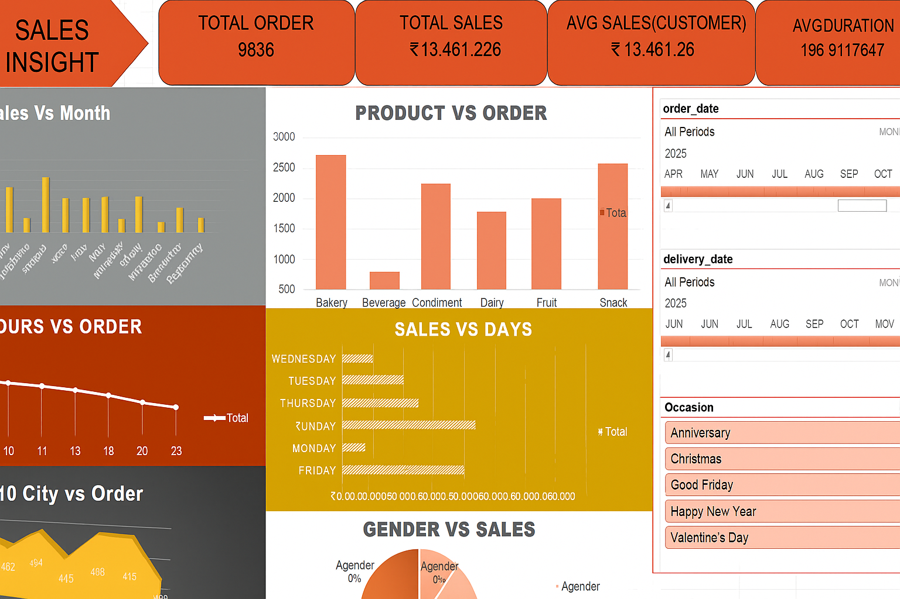

# 📊 SALES INSIGHT DASHBOARD

Welcome to my **Sales Insight Dashboard Project** – a comprehensive data analytics visualization built entirely in **Microsoft Excel** to uncover business-critical insights from sales data.

## 🧠 Project Overview

This project focuses on analyzing and visualizing sales data across multiple dimensions to generate meaningful insights. The visual dashboard answers essential business questions like:

- How are sales distributed across months?
- Which product categories drive the most orders?
- What are the peak sales hours and days?
- How does sales vary by gender?
- Which cities have the highest number of orders?
- What’s the sales performance during various occasions?

---

## 📷 Dashboard Preview

---

## 📌 Key Metrics Displayed

| Metric                 | Value           |
|------------------------|-----------------|
| **Total Orders**       | 9836            |
| **Total Sales**        | ₹13,461.26      |
| **Avg. Sales/Customer**| ₹13,461.26      |
| **Avg. Duration**      | 196.91 (units unspecified) |

---

## 📊 Dashboard Sections

### 1. **Sales vs Month**
Visual comparison of monthly revenue trends to identify high-performing and low-performing months.

### 2. **Product vs Order**
Shows which product categories like **Bakery, Snack, Condiment, Dairy** drive the most number of orders.

### 3. **Hours vs Order**
Displays order trends by hour to understand peak purchase times.

### 4. **Sales vs Days**
Analyzes which days of the week yield the highest total sales.

### 5. **Top 10 Cities vs Order**
Highlights the cities contributing most to overall sales activity.

### 6. **Gender vs Sales**
Pie chart distribution of sales across gender identities: Female, Male, Agender, Genderfluid.

### 7. **Date & Occasion Filters**
Slicers for:
- **Order Date**
- **Delivery Date**
- **Occasions** (e.g., Christmas, Good Friday, Valentine's Day)

These slicers make the dashboard interactive, allowing deep-dive analysis for specific periods or events.

---

## 🛠 Tools Used

- **Microsoft Excel**
  - Pivot Tables
  - Charts and Graphs
  - Slicers
  - Data Cleaning & Aggregation
